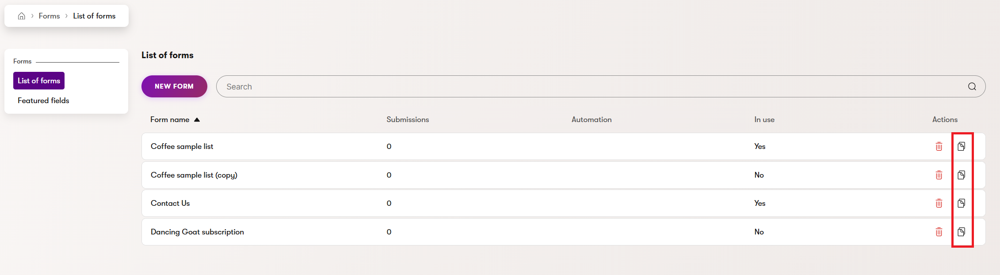
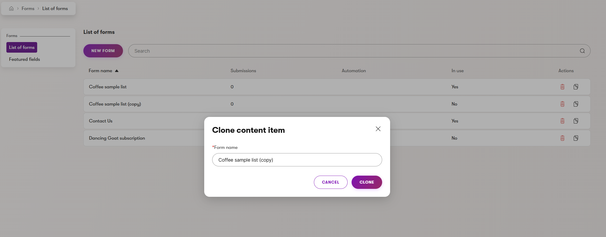

# Usage Guide

**XperienceCommunity.FormClone** is an [Xperience by Kentico](https://docs.kentico.com) admin extension that adds a **Clone form** action to the Forms list in the administration UI. With a single click, editors can duplicate any existing BizForm — including its field definitions and Form Builder layout — under a new display name, without recreating the form from scratch.

## Installation

Install the NuGet package into your Xperience by Kentico web application project:

```powershell
dotnet add package XperienceCommunity.FormClone
```

## Setup

Register the services in `Program.cs`:

```csharp
builder.Services.AddXperienceCommunityFormClone();
```

## Usage

Once installed and registered, the **Clone form** action appears in the row actions of the Forms list under **Digital Marketing > Forms**.



Clicking the clone icon opens the **Clone content item** dialog. The new form's name is pre-filled as `{original name} (copy)`. You can change it before confirming.



After clicking **Clone**, the new form appears in the list.

### What is copied

| Item                         | Copied |
| ---------------------------- | ------ |
| Field definitions            | Yes    |
| Form Builder layout          | Yes    |
| Submit button text and image | Yes    |
| Activity logging setting     | Yes    |
| Form access settings         | Yes    |
| Report fields                | Yes    |
| Submissions                  | No     |
| Automation triggers          | No     |

### Permissions

The clone action is only enabled for users with the **Create** permission on Forms.
